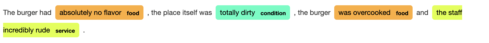
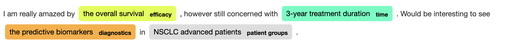

<h2>Project Description</h2>

<h3> vecner :  A set of tools for lexical-based NER </h3>

[](https://github.com/PyCQA/pylint)
[](http://mypy-lang.org/)
[](https://pypi.org/project/black/)
<!-- [](https://docs.python.org/3/library/unittest.html) -->

A library of tools for lexical-based Named Entity Recognition (NER), based on word vector representations to expand lexicon terms. Vecner is particularly helpful in instances such as: a) the lexicon contains limited terms ; b) interested in domain-specific NER and c) a large unlabelled corpora is available.

An example: if in the lexicon we have the only the word *football* under the label **sports**, we can expect that similar terms include *soccer*, *basketball* and others. As such, we can leverage that to our advantage when we have a lexicon with limited terms (see Examples below), by expanding the terms under **sports** using a w2vec model. This works also well when we have a domain-specific problem and a corpus, which we use to train a w2vec model. As such, the similar terms suddenly become much more relevant to our application.

Vecner supports:
* Exact entity matching based on [Spacy](https://spacy.io/)'s PhraseMatcher
* Finding entities based on similar terms in the lexicon.
* Chunking by:
  * Using [Spacy](https://spacy.io/)'s noun chunking
  * Using entity edges from a dependency graph
  * Using a user-defined script ([see more here](#user-defined))

### Installation

Can install by running:

```bash
python setup.py install
```

<h3> Examples </h3>

<h5> 1. Using pretrained models</h5>

This example shows how to use a pre-trained on general corpora [Gensim](https://radimrehurek.com/gensim/) w2vec model to perform NER with vecner (run this in [jupyter](examples/restaurant-example.ipynb)).

```python
from vecner import ExactMatcher, ExtendedMatcher
import gensim.downloader as api

text = """
The burger had absolutely no flavor,
the place itself was totally dirty, the burger
was overcooked and the staff incredibly rude.
"""

# loads the pretrained on general corpora model
model = api.load("glove-wiki-gigaword-100")

# sense check and test
model.most_similar('food')

# custom defined lexicon
food_lexicon = {
    'service' : [
        'rude',
        'service',
        'friendly'
    ],
    'general' : [
        'clean',
        'dirty',
        'decoration',
        'atmosphere'
    ],
    'food' : [
        'warm',
        'cold',
        'flavor',
        'tasty',
        'stale',
        'disgusting',
        'delicious'
    ]
}

# init the exact matcher to not miss
# any entities from the lexicon if in text
matcher = ExactMatcher(
    food_lexicon,
    spacy_model     = 'en_core_web_sm'
)

# init the Extended Matcher, which expands the lexicon
# using the w2vec model based on similar terms
# and then matches them in the sequence
extendedmatcher = ExtendedMatcher(
    food_lexicon,
    w2vec_model     = model,
    in_pipeline     = True,
    spacy_model     = 'en_core_web_sm',
    chunking_method = 'edge_chunking',
    sensitivity     = 20
)

# exact mapping
output = matcher.map(
    text = text
)

# extended matching mapping
output = extendedmatcher.map(
    document = output['doc'],
    ents = output['ents'],
    ids = output['ids']
)
```


<!-- <div class="entities" style="line-height: 2.5; direction: ltr">The burger had <mark class="entity" style="background: #FFAC33; padding: 0.45em 0.6em; margin: 0 0.25em; line-height: 1; border-radius: 0.35em;">    absolutely no flavor    <span style="font-size: 0.8em; font-weight: bold; line-height: 1; border-radius: 0.35em; vertical-align: middle; margin-left: 0.5rem">food</span></mark> , the place itself was <mark class="entity" style="background: #33FFC1; padding: 0.45em 0.6em; margin: 0 0.25em; line-height: 1; border-radius: 0.35em;">    totally dirty    <span style="font-size: 0.8em; font-weight: bold; line-height: 1; border-radius: 0.35em; vertical-align: middle; margin-left: 0.5rem">condition</span></mark> , the burger <mark class="entity" style="background: #FFAC33; padding: 0.45em 0.6em; margin: 0 0.25em; line-height: 1; border-radius: 0.35em;">    was overcooked    <span style="font-size: 0.8em; font-weight: bold; line-height: 1; border-radius: 0.35em; vertical-align: middle; margin-left: 0.5rem">food</span></mark> and <mark class="entity" style="background: #DDFF33; padding: 0.45em 0.6em; margin: 0 0.25em; line-height: 1; border-radius: 0.35em;">    the staff incredibly rude    <span style="font-size: 0.8em; font-weight: bold; line-height: 1; border-radius: 0.35em; vertical-align: middle; margin-left: 0.5rem">service</span></mark> .</div> -->

<h5> 2. Using custom trained Gensim w2vec models</h5>

This example shows how to use a custom trained [Gensim](https://radimrehurek.com/gensim/) w2vec model on your own corpora to perform NER with vecner (run this in [jupyter](examples/bio-example.ipynb)).

```python

from vecner import ExactMatcher, ThresholdMatcher
from gensim.models import KeyedVectors

text = """
I am really amazed by the overall survival,
however still concerned with 3-year treatment duration.
Would be interesting to see the predictive biomarkers in NSCLC advanced patients.
"""

# loads the pre-trained Gensim model
model = KeyedVectors.load('path_to_model')

# check that model was loaded properly
model.most_similar('pfs')

# custom defined lexicon
bio_lexicon = {
    'efficacy' : [
        'overall survival',
        'pfs'
    ],
    'diagnostics' : [
        'marker'
    ],
    'time' : [
        'year',
        'month'
    ],
    'patient groups' : [
        'squamous',
        'resectable'
    ]

}

# init the Exact Matcher for finding entities
# as exactly mentioned in the lexicon
matcher = ExactMatcher(
  bio_lexicon,
  spacy_model='en_core_web_sm'
)

# init the ThresholdMatcher which finds entities
# based on a cosine similarity threshold
thresholdmatcher = ThresholdMatcher(
    bio_lexicon,
    w2vec_model=model,
    in_pipeline=True,
    spacy_model='en_core_web_sm',
    chunking_method='noun_chunking',
    threshold = 0.55
)

# map exact entities
output = matcher.map(
    text = text
)

# use in pipeline to map inexact entities
output = thresholdmatcher.map(
    document = output['doc'],
    ents = output['ents'],
    ids = output['ids']
)
```


<!-- <div class="entities" style="line-height: 2.5; direction: ltr">I am really amazed by <mark class="entity" style="background: #DDFF33; padding: 0.45em 0.6em; margin: 0 0.25em; line-height: 1; border-radius: 0.35em;">    the overall survival    <span style="font-size: 0.8em; font-weight: bold; line-height: 1; border-radius: 0.35em; vertical-align: middle; margin-left: 0.5rem">efficacy</span></mark> , however still concerned with <mark class="entity" style="background: #33FFC1; padding: 0.45em 0.6em; margin: 0 0.25em; line-height: 1; border-radius: 0.35em;">    3-year treatment duration    <span style="font-size: 0.8em; font-weight: bold; line-height: 1; border-radius: 0.35em; vertical-align: middle; margin-left: 0.5rem">time</span></mark> . Would be interesting to see <mark class="entity" style="background: #FFAC33; padding: 0.45em 0.6em; margin: 0 0.25em; line-height: 1; border-radius: 0.35em;">    the predictive biomarkers    <span style="font-size: 0.8em; font-weight: bold; line-height: 1; border-radius: 0.35em; vertical-align: middle; margin-left: 0.5rem">diagnostics</span></mark> in <mark class="entity" style="background: #ddd; padding: 0.45em 0.6em; margin: 0 0.25em; line-height: 1; border-radius: 0.35em;">    NSCLC advanced patients    <span style="font-size: 0.8em; font-weight: bold; line-height: 1; border-radius: 0.35em; vertical-align: middle; margin-left: 0.5rem">patient groups</span></mark> .</div> -->

<h5> 3. Using a User-Defined Script </h5>
 <a name="user-defined"></a>

```python
from vecner import ExactMatcher, ThresholdMatcher
from gensim.models import KeyedVectors

text = """
I am really amazed by the overall survival,
however still concerned with 3-year treatment duration.
Would be interesting to see the predictive biomarkers in NSCLC advanced patients.
"""

# loads the pre-trained Gensim model
model = KeyedVectors.load('path_to_model')

# check that model was loaded properly
model.most_similar('pfs')

# custom defined lexicon
bio_lexicon = {
    'efficacy' : [
        'overall survival',
        'pfs'
    ],
    'diagnostics' : [
        'marker'
    ],
    'time' : [
        'year',
        'month'
    ],
    'patient groups' : [
        'squamous',
        'resectable'
    ]

}

# init the ThresholdMatcher which finds entities
# based on a cosine similarity threshold
thresholdmatcher = ThresholdMatcher(
    bio_lexicon,
    w2vec_model=model,
    in_pipeline=False,
    spacy_model='en_core_web_sm',
    chunking_method='custom_chunking',
    threshold = 0.55
)

# use in pipeline to map inexact entities
output = thresholdmatcher.map(
    document = text
)
```

where the custom script from which this reads from, must:
* be named as  ```custom_file.py```
* have the function ```rule_chunker```, with input arguments:
  * doc
  * ents
  * ids

You can find and play with the following [example script](examples/example-custom_file.py) prepared. To run it simply rename to ```custom_file.py``` in the directory in which you will run your main script. To prepare your own you can follow the template below:

```python
## Template - custom_file.py
"""
Template for the custom rules file
"""
from typing import List, Dict, Any, Optional

def rule_chunker(
                    doc     : object,
                    ents    : Optional[List[Dict[str, any]]],
                    ids     : Optional[Dict[int,str]] = None
                ) -> List[Dict[str, any]]:
    """
    a custom chunker and/or entity expander
    Args:
        doc (object): spacy.doc object
        ents (List[Dict[str, any]]): the entities -> [  {
                                                            'start' : int,
                                                            'end'   : int,
                                                            'text'  : str,
                                                            'label' : label,
                                                            'idx'   : int
                                                        },
                                                        ...
                                                    ]
            where 'start' is the start character in the sequence
                  'end' the end character in the sequence
                  'text' the entity textstring
                  'label' the entity name
                  'idx' the position of the first word in the entity in the sequence
        ids (Dict[int,str]) : the entity idx's and their labels for easy recognition -> e.g. {
                                                                                                1 : 'time',
                                                                                                5 : 'cost',
                                                                                                ...
                                                                                            }
    Returns:
        List[Dict[str, any]]
    """

    new_ents = []

    raise NotImplementedError

    return new_ents
```


<h2> Third Party Licenses </h2>

Third Party Libraries licenses for the dependencies:

[Spacy](https://github.com/explosion/spaCy) : [MIT License](https://github.com/explosion/spaCy/blob/master/LICENSE)\
[Gensim](https://github.com/RaRe-Technologies/gensim) : [LGPL-2.1 license](https://github.com/RaRe-Technologies/gensim/blob/develop/COPYING)\
[NLTK](https://github.com/nltk/nltk) : [Apache License 2.0](https://github.com/nltk/nltk/blob/develop/LICENSE.txt)\
[Scipy](https://github.com/scipy/scipy) : [BSD 3-Clause "New" or "Revised" License](https://github.com/scipy/scipy/blob/main/LICENSE.txt)


<h2> License </h2>
<!-- Copyright 2020 AXA Group Operations S.A. -->
Licensed under the Apache 2.0 license (see the [LICENSE file](LICENSE)).
